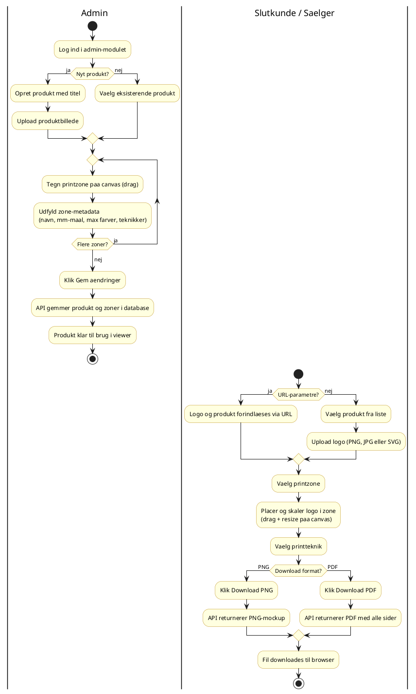

# Activity Diagram — User Flows

Paste into **plantuml.com/plantuml**

```plantuml
@startuml

skinparam backgroundColor white
skinparam activityBackgroundColor LightYellow
skinparam activityBorderColor DarkGoldenRod

|Admin|
start
:Log ind i admin-modulet;
if (Nyt produkt?) then (ja)
    :Opret produkt med titel;
    :Upload produktbillede;
else (nej)
    :Vaelg eksisterende produkt;
end if

repeat
    :Tegn printzone paa canvas (drag);
    :Udfyld zone-metadata\n(navn, mm-maal, max farver, teknikker);
repeat while (Flere zoner?) is (ja)
->nej;

:Klik Gem aendringer;
:API gemmer produkt og zoner i database;
:Produkt klar til brug i viewer;
stop

|Slutkunde / Saelger|
start
if (URL-parametre?) then (ja)
    :Logo og produkt forindlaeses via URL;
else (nej)
    :Vaelg produkt fra liste;
    :Upload logo (PNG, JPG eller SVG);
end if

:Vaelg printzone;
:Placer og skaler logo i zone\n(drag + resize paa canvas);
:Vaelg printteknik;

if (Download format?) then (PNG)
    :Klik Download PNG;
    :API returnerer PNG-mockup;
else (PDF)
    :Klik Download PDF;
    :API returnerer PDF med alle sider;
end if

:Fil downloades til browser;
stop

@enduml
```
