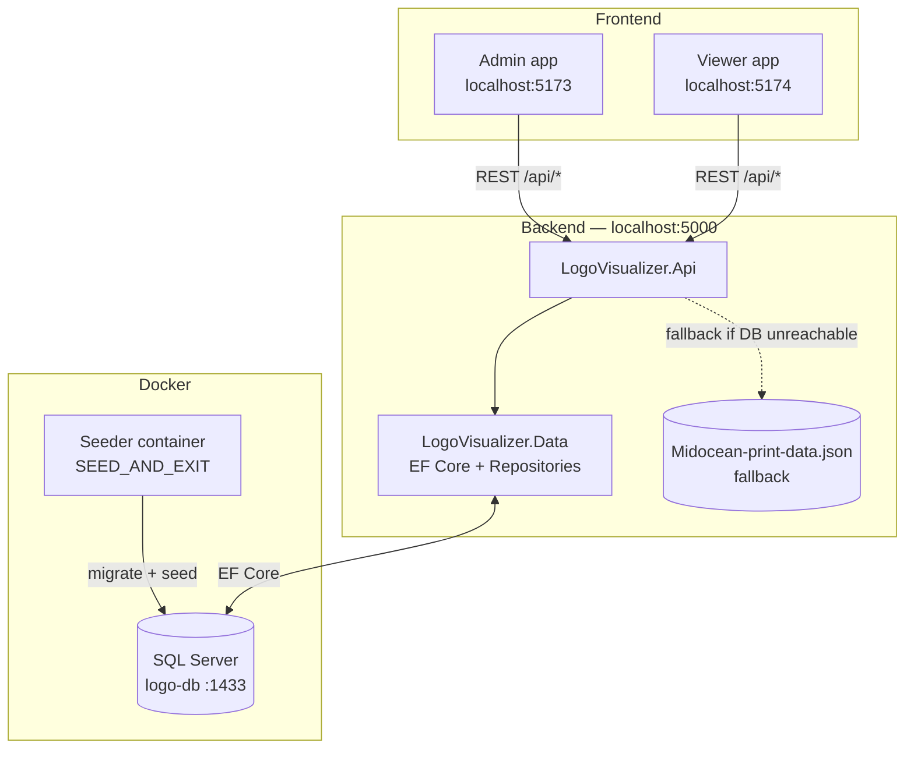
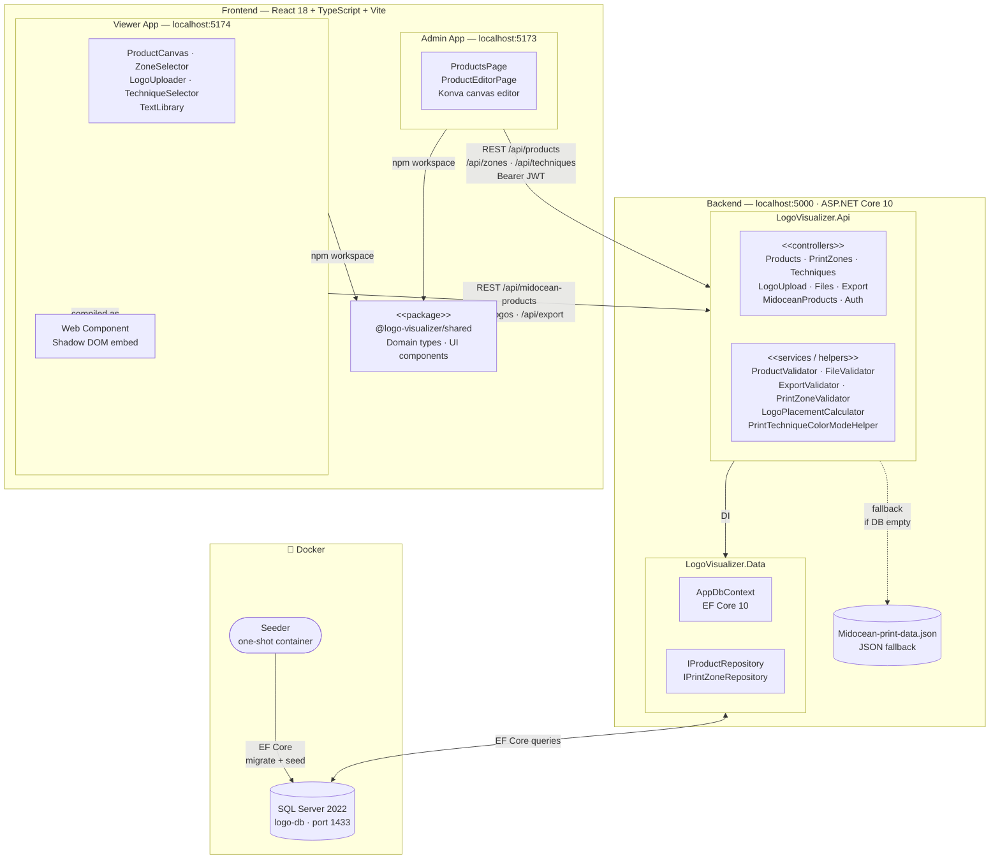

# Architecture — Logo Visualizer

This document describes how the four components of the Logo Visualizer system fit together: the database, the backend API, the admin tool, and the viewer.

---

## Component overview



---

## Startup sequence

### 1. Database + seeder (Docker)
```
docker compose up -d
```
1. `mssql` container starts — SQL Server 2022 on port 1433.
2. Docker healthcheck polls `/opt/mssql-tools18/bin/sqlcmd` until SQL Server is ready.
3. `seeder` container starts (depends on `mssql: service_healthy`).
4. Seeder runs `dotnet LogoVisualizer.Api.dll` with `SEED_AND_EXIT=true`.
5. `Program.cs` detects the env var → runs `db.Database.Migrate()` (applies all pending EF migrations) then `MidoceanSeederService.SeedAsync()`.
6. Seeder exits with code 0. The `mssql` container keeps running; its data is persisted in the `sql_data` Docker volume.

`MidoceanSeederService.SeedAsync()` is idempotent — it checks `db.Products.AnyAsync()` first and skips if products already exist.

### 2. Backend (local)
```
cd backend-bachelor-logo-visualiser/LogoVisualizer.Api
dotnet run
```
1. `Program.cs` runs `ApplyMigrations()` (no-op if already applied) and `MidoceanSeederService.SeedAsync()` (skips — products exist).
2. `MidoceanProductService` singleton loads `Midocean-print-data.json` into memory for the JSON fallback.
3. API starts on `http://localhost:5000`.

### 3. Frontend
```
npm run dev:admin    # http://localhost:5173
npm run dev:viewer   # http://localhost:5174
```
Both Vite dev servers proxy `/api/*` to `http://localhost:5000`.

---

## Data flow — product data

```
Midocean-print-data.json
        │
        ▼
MidoceanSeederService          (runs once on first startup)
        │  maps position_id → PrintZone, technique codes → PrintTechnique
        │  stores per-zone ImageUrl (blank product photo for each print position)
        ▼
SQL Server — Products + PrintZones + PrintZoneTechniques tables
        │
        ▼
ProductDataService.GetAllAdaptedAsync()
        │  queries DB with EF Core
        │  maps Product + PrintZone entities → AdaptedProductDto
        │  if DB unreachable or empty → falls back to MidoceanProductService (JSON)
        ▼
GET /api/midocean-products/as-products
        │
        ├──▶ Admin app  (ProductsPage, ProductEditorPage)
        └──▶ Viewer app (product picker grid)
```

### Technique name mapping

Midocean technique codes (e.g. `SP`, `E`, `DTG`) are mapped to normalised names at two points:

| Layer | Direction | Logic |
|-------|-----------|-------|
| `MidoceanSeederService.MapTechnique()` | Midocean code → DB name | `SP/TR/ST1` → `screen_print`, `E/EM` → `embroidery`, etc. |
| `PrintZonesController.ResolveTechniquesAsync()` | Frontend name → DB entity | case-insensitive match; handles both `screen_print` and `Screen Print` (underscore↔space) |
| `productApi.normalizeProduct()` | Backend `{id, name}` objects → `PrintTechnique` strings | `typeof t === "string" ? t : t.name` for each item in `allowedTechniques` |

---

## Data flow — zone lifecycle

```
Admin draws zone on canvas (inline in ProductEditorPage)
        │  click-drag on product image background → new zone added to local React state
        │  with a temporary id (e.g. "temp-1745000000000"); enters edit mode automatically
        ▼
Inline zone form (ProductEditorPage)
        │  admin fills: name, position px (X/Y), size px (Bredde/Højde),
        │  mm constraints, max colours, techniques
        │  canvas drag/resize live-updates x/y/width/height in state
        │  all other field changes update local draft only — nothing sent to backend yet
        ▼
"Gem ændringer" → productApi.updateProduct()  →  PUT /api/products/{id}
        │  sends: full product metadata + complete zones list
        │  (new zones with temp ids, edited zones with real ids, deleted zones omitted)
        ▼
ProductsController.UpdateFull()
        │  diffs incoming zones against DB rows:
        │    • zone with no matching DB id → INSERT (new PrintZone)
        │    • zone with matching DB id    → UPDATE
        │    • DB zone absent from list    → DELETE
        │  resolves technique names → PrintTechnique IDs via ResolveTechniquesAsync
        │  returns full ProductDetailDto with real DB ids on all zones
        ▼
ProductEditorPage.handleSaveAll()  →  setZones(saved.printZones)
        (all zones now have numeric DB id strings, e.g. "12")
```

---

## Data flow — viewer logo placement

```
Viewer: user selects product  →  no zones pre-selected
        │  canvas shows all zone outlines on FRONT image
        ▼
User activates zones via ZoneSelector
        │  toSideZoneId() ensures viewedZoneId always points to FRONT or BACK
        ▼
User uploads logo  →  POST /api/logos/upload  →  returns { fileId, url }
        ▼
ProductCanvas renders logo in each active zone
        │  isBackZone(z.name) groups zones by side (not by imageUrl)
        │  ARM zones: displayXForZone mirrors right arm x coordinate
        │  logo draggable within zone boundary (dragBoundFunc)
        │  logo resizable via Transformer (boundBoxFunc)
        ▼
User clicks Download PNG
        →  POST /api/export/png  (sends logoId, zoneId, pixel position/size)
        →  ExportController composites logo onto product image via ImageSharp
        →  returns PNG blob  →  browser downloads file
```

---

## Authentication

### Development (local)
```
Admin write (POST/PUT/DELETE)
        │
        ▼
productApi.ensureToken()       (called once, result cached in module scope)
        │  POST /api/auth/dev-token
        │  AuthController issues 1-year JWT signed with dev key from appsettings
        ▼
axios default header: Authorization: Bearer <token>
        │  all subsequent requests carry the token automatically
        ▼
[Authorize] endpoints accept it
```

`/api/auth/dev-token` returns 404 in any environment other than Development, so it cannot be used in production.

### Production (intended)
The external **Master application** issues JWT tokens. The backend validates them using `Jwt:Issuer`, `Jwt:Audience`, and `Jwt:Key` from appsettings / environment variables. The frontend (or the page embedding the admin tool) must obtain a token from Master and pass it to the admin app.

---

## Zone display rules (viewer canvas)

| Zone name pattern | Side | Display x |
|-------------------|------|-----------|
| matches `^front$` (case-insensitive) | front | `zone.x * scale` |
| matches `back` | back | `zone.x * scale` |
| matches `arm` but not `back` | front | `zone.x * scale` |
| matches `right` (ARM_RIGHT) | front | `(imageWidth - zone.x - zone.width) * scale` (mirrored) |
| anything else | front | `zone.x * scale` |

"Se side" buttons in the viewer only show FRONT and BACK — not CHEST, ARM, etc. Switching view always resolves `viewedZoneId` to a FRONT or BACK zone; activating a CHEST or ARM zone never switches the canvas background away from FRONT.

---

## Database

**Connection (development):** `Server=localhost,1433;Database=LogoVisualizer;User Id=sa;Password=YourStrong!Passw0rd;TrustServerCertificate=True`

**Applied migrations:**

| Migration | What it adds |
|-----------|-------------|
| `InitialCreate` | `Products`, `PrintZones`, `PrintTechniques`, `PrintZoneTechniques`, `AuditLogs` tables; technique seed data |
| `AddPrintZoneImageUrl` | `ImageUrl` nullable column on `PrintZones` |
| `RemoveAuditLogAndFixDecimalPrecision` | Drops unused `AuditLogs` table; adds explicit precision (10, 2) to `MaxPhysicalWidthMm` and `MaxPhysicalHeightMm` |
| `RenameToSlugTechniques` | Renames technique `Name` values to slug format (e.g. `screen_print`) |
| `AddFixedLogoToZone` | Adds `FixedLogoUrl`, `FixedLogoFileId`, `FixedLogoX/Y/Width/Height` nullable columns to `PrintZones` |
| `AddFixedLogoTechniqueAndColorCount` | Adds `FixedLogoTechnique` and `FixedLogoColorCount` nullable columns to `PrintZones` |

**Technique seed data** (from `AppDbContext.OnModelCreating`):

| Id | Name | Maps from frontend |
|----|------|--------------------|
| 1 | Screen Print | `screen_print` |
| 2 | Embroidery | `embroidery` |
| 3 | Sublimation | `sublimation` |
| 4 | Engraving | `engraving` |
| 5 | DTG | `digital_print` (approximate) |
| 6 | Pad Print | `pad_print` |
| 7 | Digital Print | `digital_print` |

---

## Komponentdiagram

> Paste the code block below into **[mermaid.live](https://mermaid.live)** to view or export the diagram.



---

## Key conventions

| Convention | Detail |
|------------|--------|
| Zone `id` in frontend | Numeric DB integer serialised as string, e.g. `"12"` — never a Midocean master code when DB is active |
| Zone type checks | Always use `zone.name`, never `zone.id` — `zone.id` is a number string, not a position name |
| Pixel ↔ mm | 1px = 1mm convention for admin tool zone sizing; not physically accurate but consistent within the tool |
| Image dimensions | Midocean CDN images assumed 1000×1000 px |
| JSON fallback trigger | Any exception from EF Core (DB unreachable, schema mismatch) OR empty products table |
