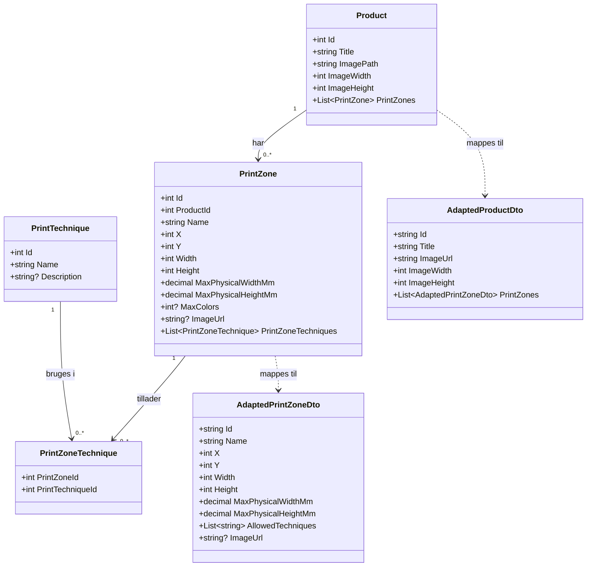

# Class Diagram — Domain Model

Paste into **mermaid.live**

```mermaid
classDiagram
    class Product {
        +int Id
        +string Title
        +string ImagePath
        +int ImageWidth
        +int ImageHeight
        +List~PrintZone~ PrintZones
    }

    class PrintZone {
        +int Id
        +int ProductId
        +string Name
        +int X
        +int Y
        +int Width
        +int Height
        +decimal MaxPhysicalWidthMm
        +decimal MaxPhysicalHeightMm
        +int? MaxColors
        +string? ImageUrl
        +List~PrintZoneTechnique~ PrintZoneTechniques
    }

    class PrintTechnique {
        +int Id
        +string Name
        +string? Description
    }

    class PrintZoneTechnique {
        +int PrintZoneId
        +int PrintTechniqueId
    }

    class AdaptedProductDto {
        +string Id
        +string Title
        +string ImageUrl
        +int ImageWidth
        +int ImageHeight
        +List~AdaptedPrintZoneDto~ PrintZones
    }

    class AdaptedPrintZoneDto {
        +string Id
        +string Name
        +int X
        +int Y
        +int Width
        +int Height
        +decimal MaxPhysicalWidthMm
        +decimal MaxPhysicalHeightMm
        +List~string~ AllowedTechniques
        +string? ImageUrl
    }

    Product        "1" --> "0..*" PrintZone          : har
    PrintZone      "1" --> "0..*" PrintZoneTechnique : tillader
    PrintTechnique "1" --> "0..*" PrintZoneTechnique : bruges i

    Product        ..> AdaptedProductDto   : mappes til
    PrintZone      ..> AdaptedPrintZoneDto : mappes til
```
