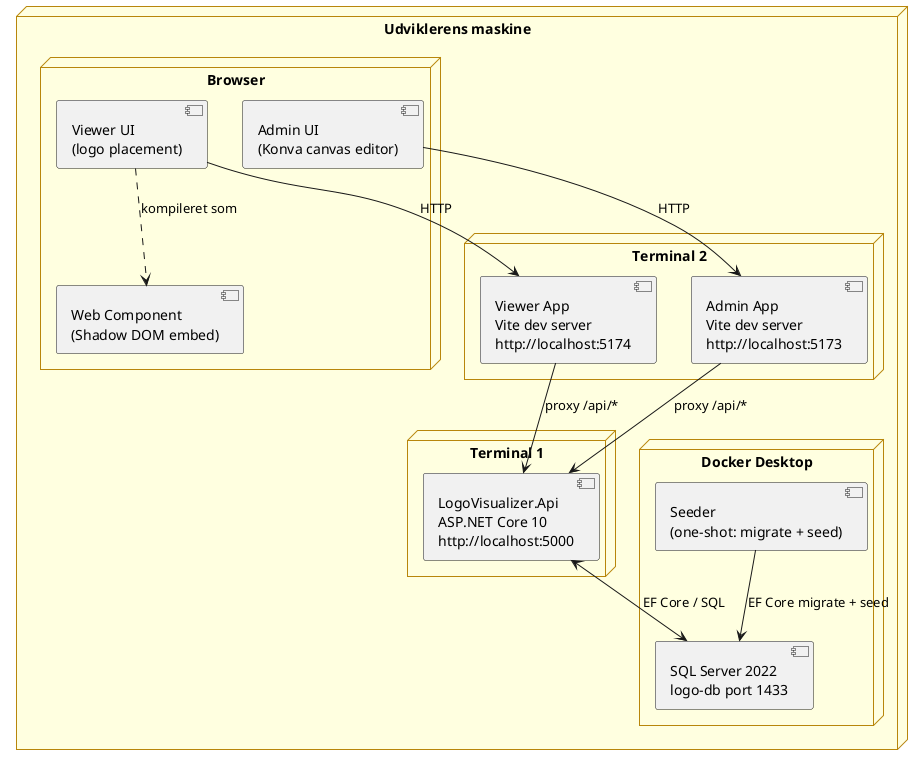

# Deployment Diagram

Paste into **plantuml.com/plantuml**

```plantuml
@startuml

skinparam node {
    BackgroundColor LightYellow
    BorderColor DarkGoldenRod
}

node "Udviklerens maskine" {

    node "Docker Desktop" {
        component "SQL Server 2022\nlogo-db port 1433" as DB
        component "Seeder\n(one-shot: migrate + seed)" as Seeder
    }

    node "Terminal 1" {
        component "LogoVisualizer.Api\nASP.NET Core 10\nhttp://localhost:5000" as API
    }

    node "Terminal 2" {
        component "Admin App\nVite dev server\nhttp://localhost:5173" as AdminDev
        component "Viewer App\nVite dev server\nhttp://localhost:5174" as ViewerDev
    }

    node "Browser" {
        component "Admin UI\n(Konva canvas editor)" as AdminUI
        component "Viewer UI\n(logo placement)" as ViewerUI
        component "Web Component\n(Shadow DOM embed)" as WC
    }
}

Seeder   -->  DB        : EF Core migrate + seed
API      <--> DB        : EF Core / SQL
AdminDev -->  API       : proxy /api/*
ViewerDev --> API       : proxy /api/*
AdminUI  -->  AdminDev  : HTTP
ViewerUI -->  ViewerDev : HTTP
ViewerUI ..>  WC        : kompileret som

@enduml
```
