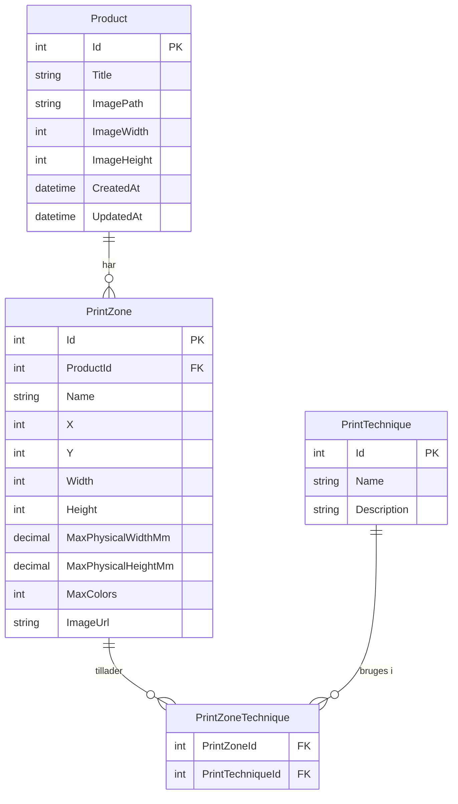

# ER Diagram — Database Schema

Paste into **mermaid.live**

```mermaid
erDiagram
    Product {
        int     Id               PK
        string  Title
        string  ImagePath
        int     ImageWidth
        int     ImageHeight
        datetime CreatedAt
        datetime UpdatedAt
    }
    PrintZone {
        int     Id               PK
        int     ProductId        FK
        string  Name
        int     X
        int     Y
        int     Width
        int     Height
        decimal MaxPhysicalWidthMm
        decimal MaxPhysicalHeightMm
        int     MaxColors
        string  ImageUrl
    }
    PrintTechnique {
        int    Id    PK
        string Name
        string Description
    }
    PrintZoneTechnique {
        int PrintZoneId      FK
        int PrintTechniqueId FK
    }

    Product        ||--o{ PrintZone          : "har"
    PrintZone      ||--o{ PrintZoneTechnique : "tillader"
    PrintTechnique ||--o{ PrintZoneTechnique : "bruges i"
```
