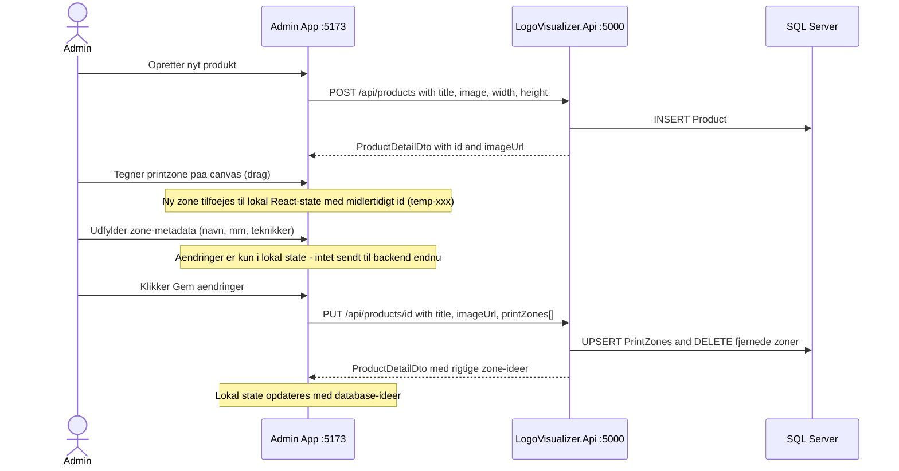

# Sequence Diagram — Admin Zone Setup Flow

Paste into **mermaid.live**

```mermaid
sequenceDiagram
    actor Admin
    participant AdminApp as Admin App :5173
    participant API as LogoVisualizer.Api :5000
    participant DB as SQL Server

    Admin->>AdminApp: Opretter nyt produkt
    AdminApp->>API: POST /api/products with title, image, width, height
    API->>DB: INSERT Product
    API-->>AdminApp: ProductDetailDto with id and imageUrl

    Admin->>AdminApp: Tegner printzone paa canvas (drag)
    Note over AdminApp: Ny zone tilfoejes til lokal React-state med midlertidigt id (temp-xxx)

    Admin->>AdminApp: Udfylder zone-metadata (navn, mm, teknikker)
    Note over AdminApp: Aendringer er kun i lokal state - intet sendt til backend endnu

    Admin->>AdminApp: Klikker Gem aendringer
    AdminApp->>API: PUT /api/products/id with title, imageUrl, printZones[]
    API->>DB: UPSERT PrintZones and DELETE fjernede zoner
    API-->>AdminApp: ProductDetailDto med rigtige zone-ideer
    Note over AdminApp: Lokal state opdateres med database-ideer
```
