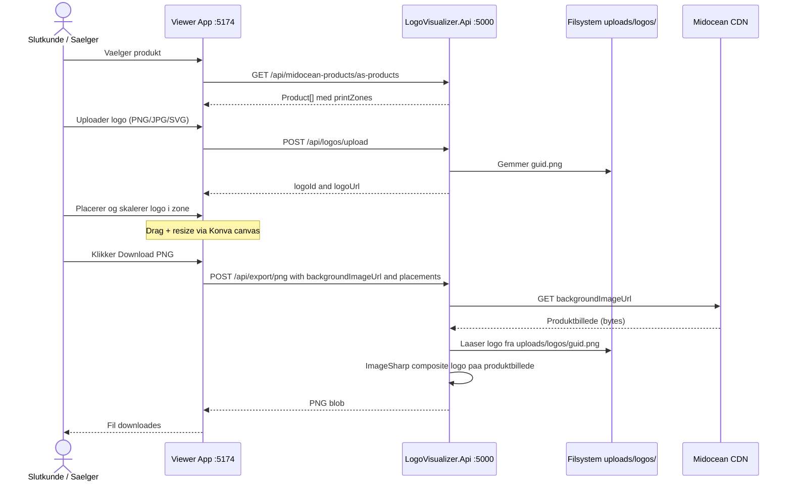

# Sequence Diagram — Logo Upload and Export Flow

Paste into **mermaid.live**

```mermaid
sequenceDiagram
    actor Bruger as Slutkunde / Saelger
    participant Viewer as Viewer App :5174
    participant API as LogoVisualizer.Api :5000
    participant FS as Filsystem uploads/logos/
    participant CDN as Midocean CDN

    Bruger->>Viewer: Vaelger produkt
    Viewer->>API: GET /api/midocean-products/as-products
    API-->>Viewer: Product[] med printZones

    Bruger->>Viewer: Uploader logo (PNG/JPG/SVG)
    Viewer->>API: POST /api/logos/upload
    API->>FS: Gemmer guid.png
    API-->>Viewer: logoId and logoUrl

    Bruger->>Viewer: Placerer og skalerer logo i zone
    Note over Viewer: Drag + resize via Konva canvas

    Bruger->>Viewer: Klikker Download PNG
    Viewer->>API: POST /api/export/png with backgroundImageUrl and placements
    API->>CDN: GET backgroundImageUrl
    CDN-->>API: Produktbillede (bytes)
    API->>FS: Laaser logo fra uploads/logos/guid.png
    API->>API: ImageSharp composite logo paa produktbillede
    API-->>Viewer: PNG blob
    Viewer-->>Bruger: Fil downloades
```
