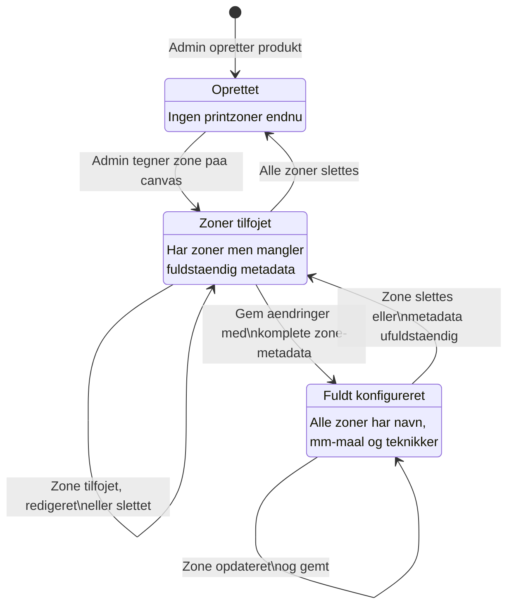

# State Diagram — Product Configuration Lifecycle

Paste into **mermaid.live**

```mermaid
stateDiagram-v2
    [*] --> Oprettet : Admin opretter produkt

    Oprettet : Oprettet
    Oprettet : Ingen printzoner endnu

    ZonerTilfojet : Zoner tilfojet
    ZonerTilfojet : Har zoner men mangler\nfuldstaendig metadata

    FuldtKonfigureret : Fuldt konfigureret
    FuldtKonfigureret : Alle zoner har navn,\nmm-maal og teknikker

    Oprettet --> ZonerTilfojet : Admin tegner zone paa canvas
    ZonerTilfojet --> Oprettet : Alle zoner slettes

    ZonerTilfojet --> ZonerTilfojet : Zone tilfojet, redigeret\neller slettet

    ZonerTilfojet --> FuldtKonfigureret : Gem aendringer med\nkomplete zone-metadata

    FuldtKonfigureret --> ZonerTilfojet : Zone slettes eller\nmetadata ufuldstaendig

    FuldtKonfigureret --> FuldtKonfigureret : Zone opdateret\nog gemt
```
