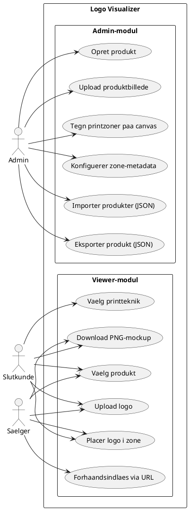

# Use Case Diagram

Paste into **plantuml.com/plantuml**

```plantuml
@startuml

left to right direction
skinparam packageStyle rectangle

actor "Admin"        as admin
actor "Slutkunde"    as customer
actor "Saelger"      as sales

rectangle "Logo Visualizer" {

    package "Admin-modul" {
        usecase "Opret produkt"             as UC1
        usecase "Upload produktbillede"     as UC2
        usecase "Tegn printzoner paa canvas" as UC3
        usecase "Konfiguerer zone-metadata" as UC4
        usecase "Importer produkter (JSON)" as UC5
        usecase "Eksporter produkt (JSON)"  as UC6
    }

    package "Viewer-modul" {
        usecase "Vaelg produkt"             as UC7
        usecase "Upload logo"               as UC8
        usecase "Placer logo i zone"        as UC9
        usecase "Vaelg printteknik"         as UC10
        usecase "Download PNG-mockup"       as UC11
        usecase "Forhaandsindlaes via URL"  as UC12
    }
}

admin    --> UC1
admin    --> UC2
admin    --> UC3
admin    --> UC4
admin    --> UC5
admin    --> UC6

customer --> UC7
customer --> UC8
customer --> UC9
customer --> UC10
customer --> UC11

sales    --> UC7
sales    --> UC12
sales    --> UC8
sales    --> UC9
sales    --> UC11

@enduml
```
